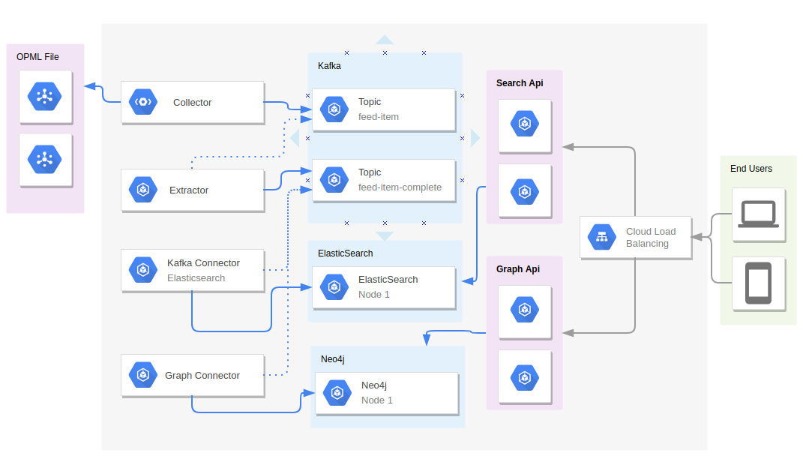

#How to run with Openshift

## Diagram

## Step by step guide

1.  Create images
    1.1 Java
    1.2 Elasticsearch
    1.3 Graph Connector (Graph Model)
    1.4 Extractor
    1.5 Collector
    1.6 Search API
    1.7 Graph API
2. Create builds
    2.1 Graph Connector (Graph Model)
    2.2 Extractor
    2.3 Collector
    2.4 Search API
    2.5 Graph API
3. Create Deployments
    3.1 Apache Kafka
    3.2 Elasticsearch
    3.3 Neo4j
    3.4 Create Services
        3.4.1 Apache Kafka
        3.4.2 Elasticsearch
        3.4.3 Neo4j
    3.5 Graph Connector (Graph Model)
    3.6 Extractor
    3.7 Collector
    3.8 Search API
    3.9 Graph API
4. Create Services
    4.1 Search API
    4.2 Graph API
5. Create Routes
    5.1 Search API
    5.2 Graph API
6. Create load balancing 